# Shining Light on Glassware: A Weight-Activated LED Fingerprinting Display for Home Bars

## Background

The blend of the physical and digital world is fascinating. As useful as crunching numbers on a desktop PC or AWS cloud instance can be, nothing elicits the "wow" factor more than when something unexpected happens in the physical world. Embedded systems are as close to magic and superpowers as people are going to get. In this project, I am going to wield my electronic superpowers to play with the crossover between digital and physical by visually fingerprinting glassware on my home bar. 

Inspiration for the project stemmed from two key sources. My intrigue with fingerprinting algorithms started after my solve of the [2022 Dice CTF "Sober Bishop" Challenge](https://github.com/dicegang/dicectf-2022-challenges/tree/master/misc/sober-bishop). Sources for light emitting diode (LED) strip circuit integrations number in the hundreds, but the specific post of [an Ikea Fjallbo shelf on r/barbattlestations](https://www.reddit.com/r/BarBattlestations/comments/jrp9ew/a_while_back_i_showed_you_guys_my_ikea_fjallbo/?utm_source=share&utm_medium=web2x&context=3) further fueled my creativity. I thought to myself earlier this year "Why stop at static recessed lighting?" and decided to fuse my two sources of inspiration together and create a lighting system that would convert the weight of a glass to a fingerprinted light show. Time to get to work.

## Hardware Implementation
My Fjallbo bar was already assembled, so I will not cover its assembly or the source of each of the items on the bar. If you would like to know more, please leave a comment on this post. Instead, I am going to focus on the three subsystems that bring the bar to life: the weight sensing system, the compute system, and the LED driving system. Rather than start by picking a compute system, I decided to start with finding the LED driving system and weight sensing system since I knew the range of glass weights as well as the type of LED strip I wanted to work with.

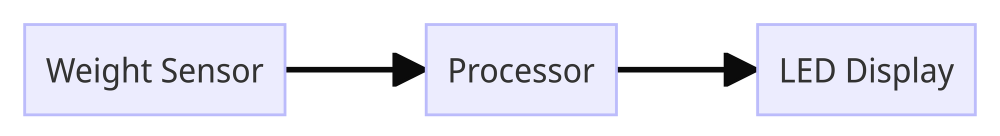

For the LEDs, I picked up a box of [Feit Electric Wi-Fi Smart 16' LED Strip Lights](https://www.costco.com/feit-electric-wi-fi-smart-16'-led-strip-light.product.100825588.html) from Costco for a fair price. The lights came with a module to enable control over WiFi, but I want to save those electronics for a potential reverse engineering or repurposing effort at a later point in time. If I were to do things again, I would pick up an individually addressable [Neopixel LED strip from Adafruit](https://www.adafruit.com/category/183). The ability to individually address each LED adds some fun options in software. For the Feit Electric LED strip I own, you can individually address each 1ft segment but this adds some complexity because the multiplexing circuitry would be DIY. Instead of doing this, I decided to cut into three main segments that I would put on different parts of the bar. **WARNING**: the design you are about to see is a highly technical piece of design tooling that took me countless hours to master. The only thing worse than my drawing ability in this project was my soldering job - if I could make that picture NSFW I would, but hey - it works.


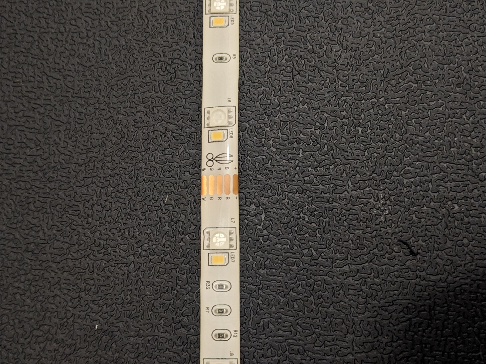

Controlling the LED color is fairly straightforward and uses the concept of pulse width modulation (PWM). In the most basic sense, PWM enables analog output with a digital system. PWM achieves this by varying the frequency of the "ON" and "OFF" pulses. A higher ratio of "ON" to "OFF" yields an analog signal closer to 5V while a higher ratio of "OFF" to "ON" yields an analog signal close to 0V.

Let's start by applying PWM to the white LED. A 24V differential between the power line and the ground line with no additional resistance (there are some resistors in the LED strip) would make the white light shine bright. On the contrary, an open circuit between the power and ground would make the white LED as dim as possible. These two concepts are at opposite ends of the spectrum; to achieve 50% brightness, we can use PWM to vary the amount of time that the white LEDs are turned on. If the LEDs are connected to ground 50% of the time and to power the other 50%, they should appear 50% as bright as long as we are [switching fast enough](https://www.ccohs.ca/oshanswers/ergonomics/lighting_flicker.html). Thankfully, the Arduino's 500Hz PWM frequency far exceeds the 120Hz rate that humans can perceive flickering. We can use this same effect to achieve any amount of brightness between 0 and 100% by altering the duty cycle of a pulse with PWM.

If PWM controls brightness, how can we control color? Well, using the same concept that was applied to the white led, we can dim/brighten the red, green, and blue LEDs in a similar way. Dimming/brightening the red, green, or blue LED individually does us no good, but combining different brightness values for each LED produces different colors. This is kind of like mixing paint, but the best way to think about this is to [visualize it with Google's color picker](https://g.co/kgs/UZ4RPU). Think of the brightness values of 0% - 100% as being mapped as values from 0-255. Change the R, G, and B values at the link provided to produce different colors. For example 52, 235, 107 produces a weird mint green. This corresponds to 52/255 (~20%) red brightness, ~90% green brightness, and ~40% blue brightness.

For the weight sensors, I wasn't sure where to start. I did not have experience in using weight sensors in the past so I looked to learn by disassembling an old [Greater Goods Brand](https://a.co/d/3RdV0FT) digital kitchen scale. Inside was some fairly simple circuitry: a LED screen to display information, 4 unknown metal chips that I could only assume were the weight sensors, and a chip-on-board. Unfortunately, the chip-on-board prevented me from the usual Google search of the integrated circuit markings to reverse-engineer the logic of the controller. As a backup I Google reverse-image searched the metallic devices that appeared in the corner of the scale. The result returned search options for "Aluminum Alloy Half Bridge Weight Sensor." My findings took me to [SparkFun's HX711](https://www.sparkfun.com/products/13879) website where I was able to learn everything I needed to on the topic of load cells. See the references for the links I found most helpful to include a hookup guide and the different types of load cells. Rather than purchase the SparkFun HX711, I opted for [4pcs 110lbs Half-Bridge Body Load Cell Weight Strain Sensor Resistance with HX711 module](https://a.co/d/7PnAYvC) from Amazon - it was both less expensive and came with some extra weight sensors for a future project, so it was a win-win to me. Sorry SparkFun! The HX711 uses DATA and CLK lines which will add an input and output requirement, respectively, to the decision of the processor. 

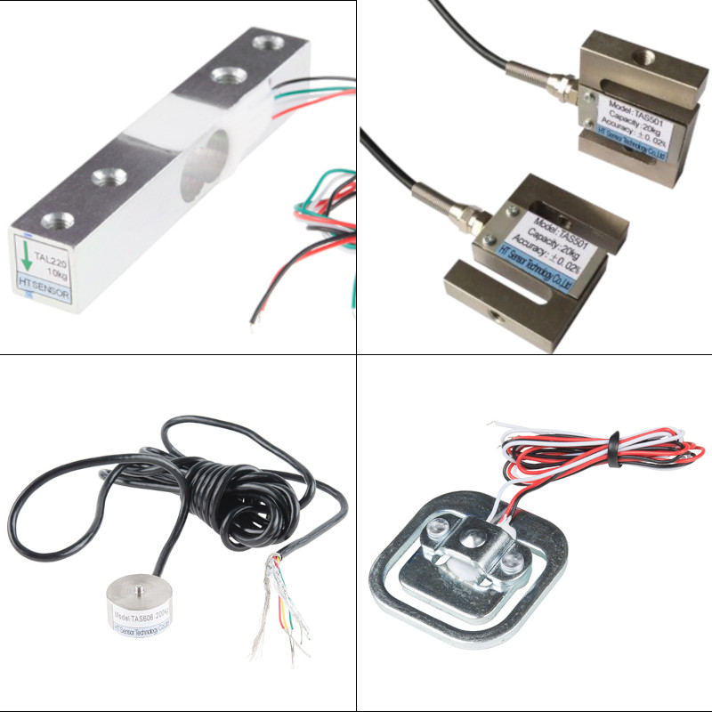

> A comparison of 4 types of strain cells. From top to bottom, left to right: straight bar, s-type, disc, and strain gauge.

The last part of the design is choosing the processor that will sense weight data and drive the LED strips. From our earlier design decisions we have a total of one input and four outputs. The singular input from the weight sensor will be an analog voltage that maps 0V to 5V to a weight value. The 4 outputs of PWM to each red, blue, green, and white LEDs will drive the intensity of each of those respective colors. Even though each of the three LED light strips can be individually addressed, in this version of the system, I chose to not implement a multiplexing output. Given the hardware that I had on hand, the Arduino Uno made the most sense here. The Arduino Uno supports 6 analog inputs and 6 PWM pins so it will be sufficient to drive our outputs and sense the input. There are also 2 spare PWM outputs and 5 spare inputs for future expansion if necessary. The Arduino should also have sufficient memory and processing capability to handle the fingerprinting algorithm.

Before we get into details about the software implementation, the last major hardware hurdle is power management. The Arduino and HX711 do not add a significant power draw beyond what the 24W (24V, 1A) power supply provided with the LED strip can accommodate; however, there will be two main operating voltages: 24V for the LEDs and 5V for the HX711 and Arduino. Nothing a buck converter can't solve - the [LM2596 Buck Converter from Texas Instruments](https://www.ti.com/lit/gpn/LM2596) was sufficient for my application. [Amazon had an inexpensive module](https://a.co/d/bLSqPYq) that integrated the LM2596 into a circuit that was easy to incorporate into my design. Now that there are two operating voltage buses, the last power issue to solve is driving the LEDs with the low current Arduino. This is a classic application of a power metal oxide semiconducter field-effect transistor (MOSFET) driver. I won't dive into the details of MOSFET drivers here, but let me know if that is a topic you would be interested in. Assembling all of these components together yields the following schematic.

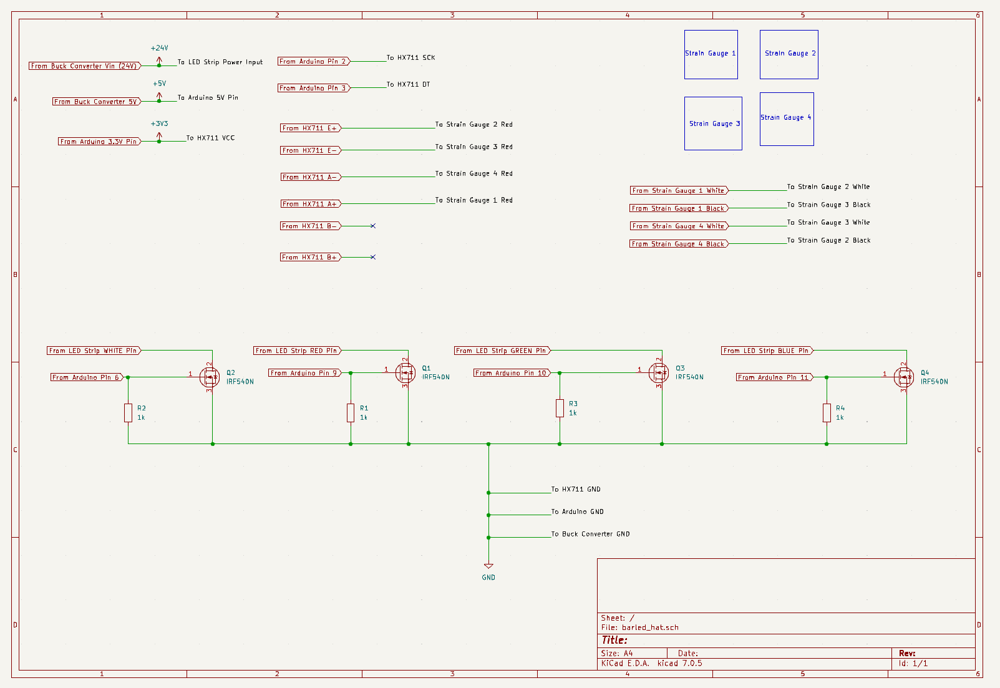

## Software Implementation

Please refer to the ["Getting Lit with the Drunk Bishop" GitHub page](https://github.com/irongiant33/getting-lit-with-the-drunk-bishop) for all software used in this project. The software for this project largely complements the hardware implementation. It leverages [Arduino's HX711 library](https://www.arduino.cc/reference/en/libraries/hx711-arduino-library/) for interfacing with the weight sensor, custom code for the Drunk Bishop implementation, and the [`analogWrite()` function for PWM control of the LEDs](https://www.arduino.cc/reference/en/language/functions/analog-io/analogwrite/). I'll let my code speak for itself, but I do want to spend some time digging into the Drunk Bishop algorithm that is responsible for the visual fingerprinting.

As I mentioned in the beginning of the article, part of the inspiration was my solve of a CTF challenge that involved the ability to [analyze the Drunk Bishop algorithm](http://aarontoponce.org/drunken_bishop.pdf). For those of you Elixir lovers that are reading this, I found an Elixir implementation here: https://github.com/tangstad/bishop. The challenge gave two 9x17 OpenSSH fingerprints: one was the flag, and the other was the md5 hash of the flag - it required you to depth-first search the flags that could generate the first fingerprint and check the flag with its md5 hash fingerprint. I liked the concept that the fingerprints served as a visual way of checking the authenticity of an SSH key by taking advantage of human pattern-recognition ability. It would be much harder to tell the difference between two keys in ASCII form than two keys in fingerprint form. Thus, the idea to visually fingerprint with LEDs was born.

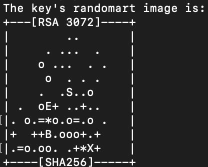

The TL;DR implementation of Drunk Bishop is a 8x8 chess board with a bishop starting at any square. The bishop can move like a normal bishop in chess, but its moves are governed by a binary string. Every pair of bits in the string determines the direction in which the bishop will move; `11` will move the bishop up and to the right, `10` up and to the left, `01` down and to the right, `00` down and to the left. The bishop can't move through walls but will slide along the wall based off of the direction of the move. 

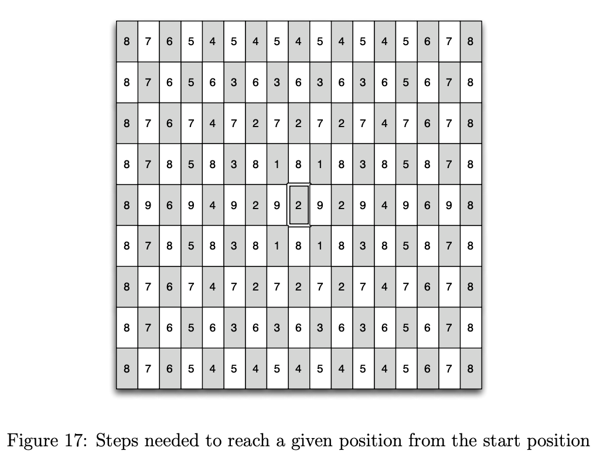

The challenge in implementing Drunk Bishop with LEDs was that I had 4 dimensions to work with: red, blue, green, and white. To avoid overcomplicating things, I decided to stick with 3 dimensions (red, green, blue) and leave the white LED for a "flourish" finale that will be addressed later. The bishop still moves along the diagonals in my implementation but now has three dimensional coordinates which require three dimensional moves. Therefore, an extra bit is needed from the binary string in order to govern direction. The first bit determines movement in the "Red" dimension, the second bit in the "Green" dimension, and the third bit in the "Blue" dimension. As mentioned in the previous section, the overlapping red, green, and blue colors will create a custom color based off of the binary input string. In this application, the input string is a binary representation of the glass weight, so each weight should have a unique color sequence. 

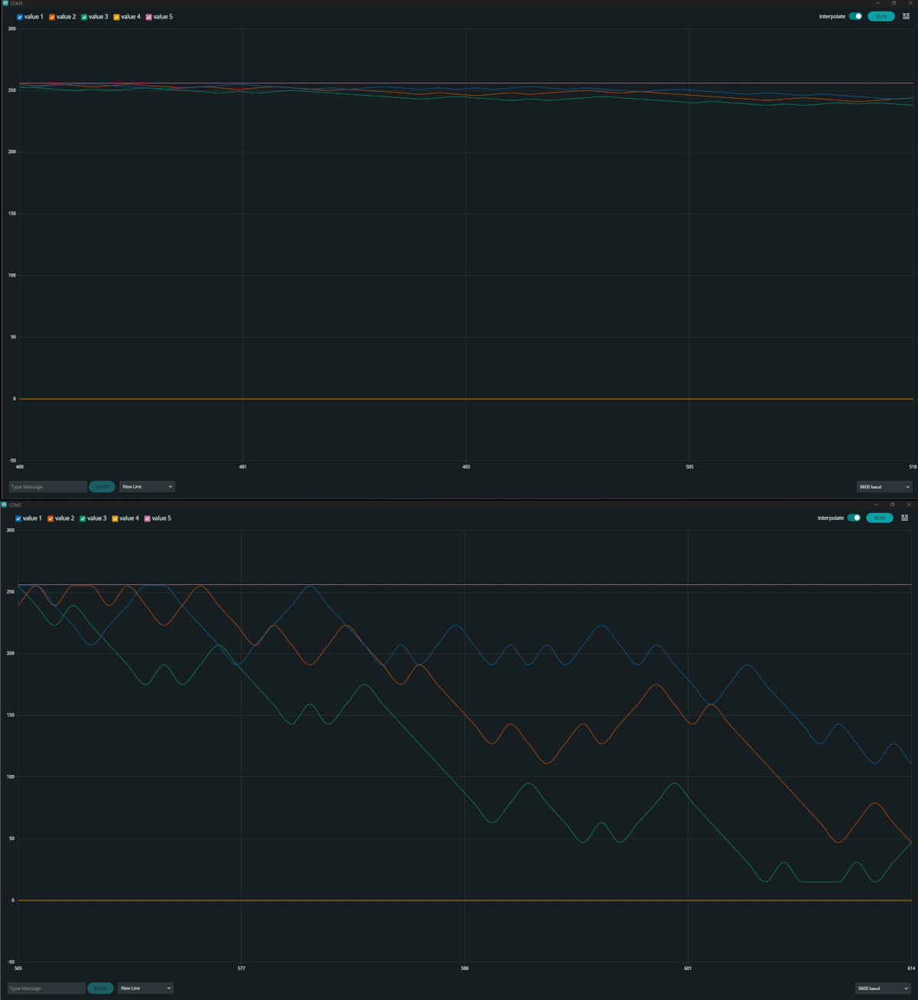

> A comparison of a step size of 1 (top plot) and a step size of 16 (bottom plot). Each color line represents its respective LED output color.

I quickly ran into an issue after implementing the algorithm. I observed the colors tend toward a local minima which meant they didn't change as often as I would have liked. You can visualize this local minima below. I hypothesized a couple of causes and solutions for the problem

| Problem | Solution |
|-----------|----------|
| Binary similarity between weight values | hashed weight values |
|  Repeating moves after the binary string loops | increase step size and add offset to artificially lengthen binary string |

Regarding the binary similarity between weight values, you can see the result of the XOR between two adjacent weight values yields a large string of similar digits, so our visual fingerprinting would start to look very similar for glasses that weigh close to each other.

```bash
4.56 => 01000000100100011110101110000101
4.57 => 01000000100100100011110101110001
XOR  => 00000000000000111101011011110100
```

The fix was to just hash the weight value using a preexisting Arduino library: https://reference.arduino.cc/reference/en/libraries/xxhash_arduino/. 

My rationale for the repeating moves was that if I have a binary string that is evenly divisible by 3 (i.e. the number of bits needed to govern the direction of the Drunk Bishop), any directional favor will win out in the long run. For example, consider the shorter binary string `11 00 11 10` which is NE, SW, NE, NW. In this case, the bishop will get stuck at the top of the matrix due to the fact that it moves up 3/4 of the time and the E/W moves cancel each other out. The hashing helped solve part of this problem by randomizing the binary input, but implementing a loop offset also helped artificially lengthen the number of unique instructions from 10 to 32. Rather than cut off the last 2 bits of the sequence and loop back from the start, I stitched the binary string together 3 times to create a 96 bit long input. Since 3 does not divide evenly into 32, we can do stitch the 32 bit string at most 3 times before the sequence begins to repeat itself. 

Below are the results of the LED cube evolution before and after the implementation of these features. Both plots use the same binary input string.

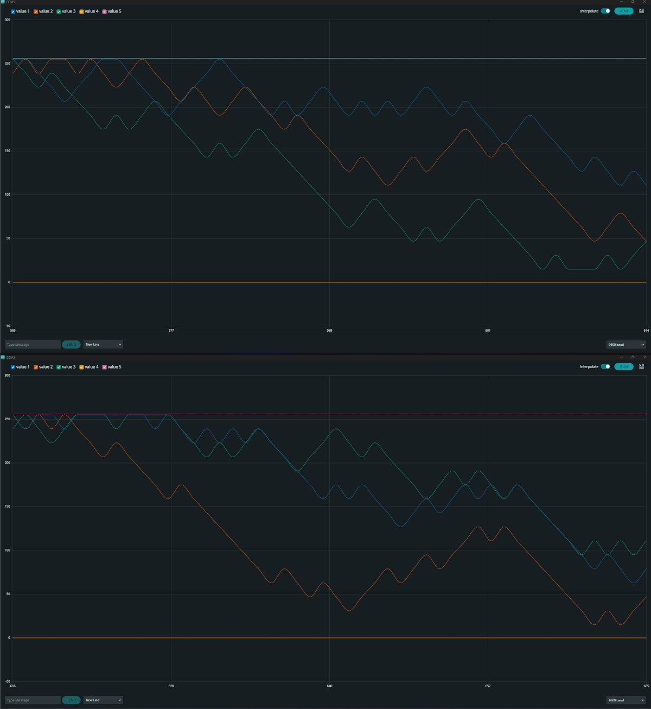

> A comparison of the un-hashed input (top plot) and hashed input (bottom plot). There is not a significant difference in these two plots.

The bigger difference in hashing was observed to be in the long-run. The two plots below are the LED values after 30 seconds of display time.

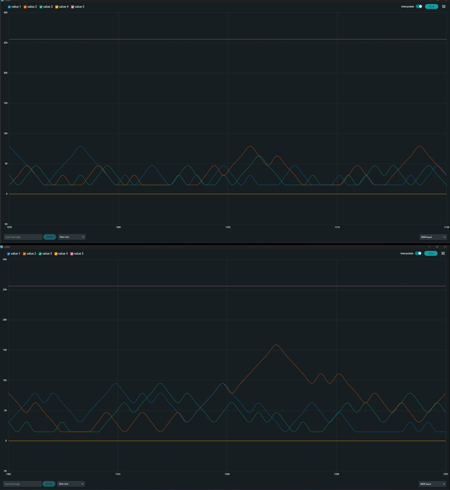

> The un-hashed steady-state display (top plot) and the hashed steady-state display (bottom plot). We can see the hashed display has slightly more variability than the unhashed display.

Now that there was a way to control the RGB LEDs, it is time to code the "flourish" finale for the white light that I mentioned earlier. My idea for the white light was that it could "pulse" while the user fills up their glass. As the weight sensor detects a steady increase in weight, the white LED brightness increases exponentially until it is 100% bright and starts over. Once the user removes the glass and the weight sensor detects an abrupt drop in weight, the RGB LEDs stop and the white light flashes 3 times quickly to signal the show is over. 

## Wrap-up & Moving Forward

The moment you've all been waiting for! The white flash is buggy right now as you'll see at the beginning and end of the video, but I am fairly happy with how things turned out.

https://youtu.be/Z1zEJhVeFfM

Overall, I enjoyed building this project and thought it was a fun way to work with both software and hardware. Like I said in the beginning of the article, the reward of the light show the second I set down my glass was enough to justify all the work that was put int. I learned a lot about weight sensing and found the [Wheatstone Bridge](https://en.wikipedia.org/wiki/Wheatstone_bridge) to be quite fascinating - I never would have expected such an elegant concept in something that seems as simple as detecting weight. 

Over time, my cats have really found a lot of enjoyment in the project as well...

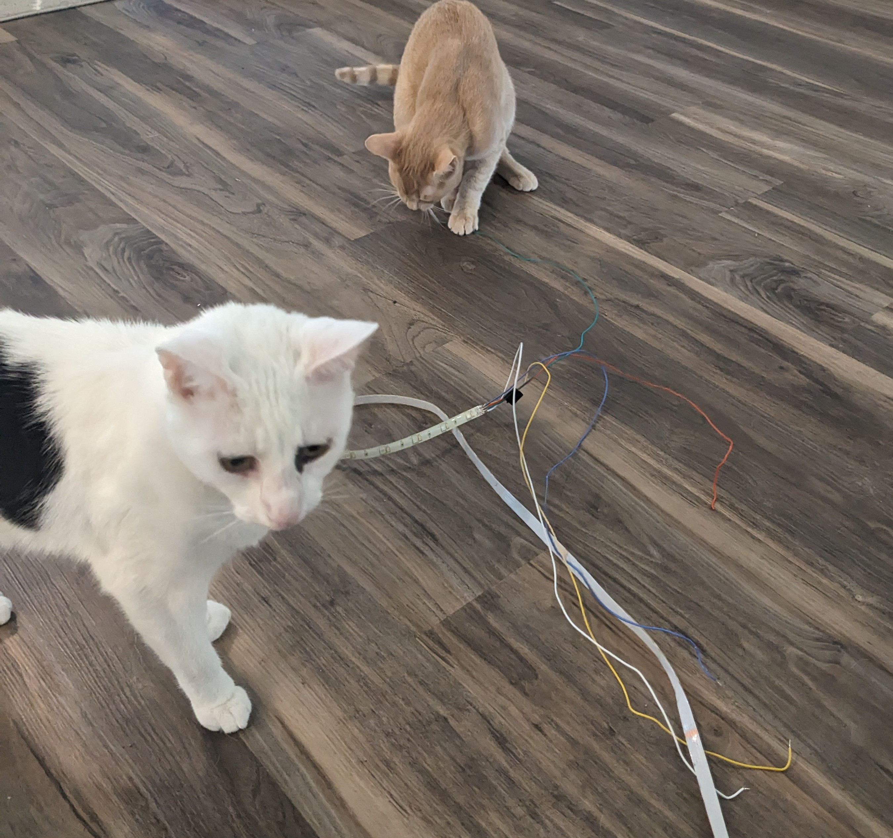

Now that my hand has been forced to rebuild, I have some thoughts for improving version 2:
- Create a PCB of the circuit rather than doing everything on a breadboard. The PCB should include an ATMEGA328
- 3D print of coaster for open source hardware functionality. As of now everything is haphazardly glued to an old coaster...
- Buy Neopixel LED strips to enable individual addressing
- Implement circuitry to enable individual addressing of each strip
- Small debugging for functionality
	- Make the light show very distinct; the visual fingerprinting doesn't matter if our eyes can't actually distinguish with our eyes how they're different because it just looks random.
	- Moving average filtering so the lighting smoothly turns on and off & transitions between colors.

What would you like to see in version 2? 

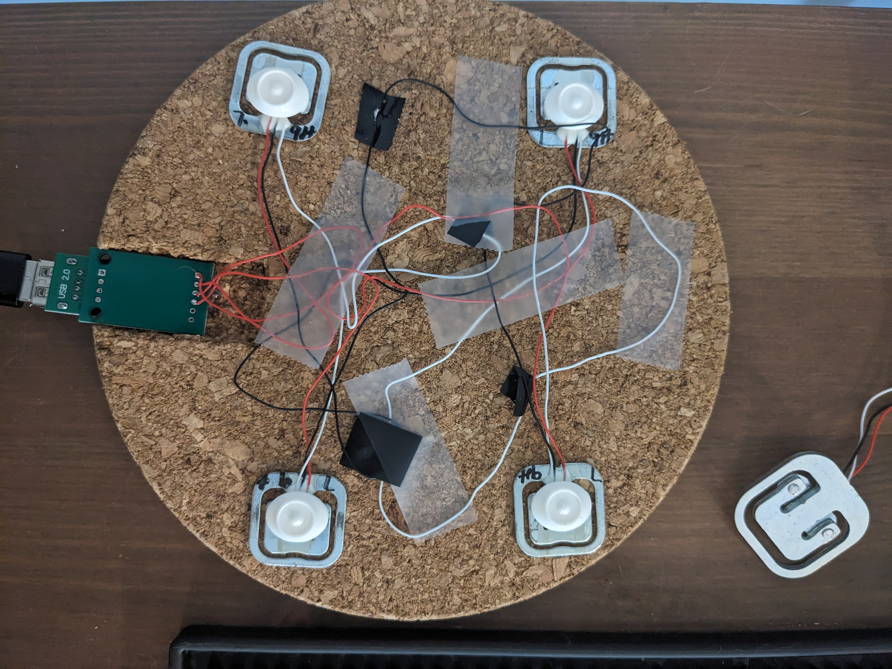

> As much as I was happy with the quality of my software and design, the elegance of the final assembled form could use improvement

#### Other Resources
- [Getting started with load cells - sparkfun](https://learn.sparkfun.com/tutorials/getting-started-with-load-cells?_gl=1*yfrrt3*_ga*Mzk5MzU0OTU5LjE2OTI0NzYwNzk.*_ga_T369JS7J9N*MTY5MjQ3NjA3OC4xLjEuMTY5MjQ3NzgxNy42MC4wLjA.&_ga=2.250248710.1435746813.1692476080-399354959.1692476079)
- [hx711 hookup guide - sparkfun](https://learn.sparkfun.com/tutorials/load-cell-amplifier-hx711-breakout-hookup-guide?_gl=1*pirsfj*_ga*Mzk5MzU0OTU5LjE2OTI0NzYwNzk.*_ga_T369JS7J9N*MTY5MjQ3NjA3OC4xLjEuMTY5MjQ3ODExOC4xOC4wLjA.&_ga=2.220755480.1435746813.1692476080-399354959.1692476079)
- [Barely Functional Theories Blog - The Drunk Bishop Algorithm](https://www.jfurness.uk/the-drunken-bishop-algorithm/)